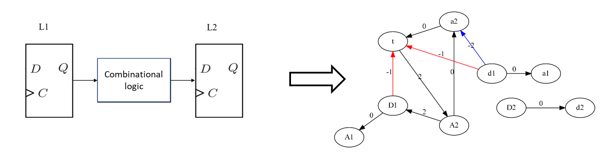

**Background**  

This project is an Iterative-Retiming with Latch-based Time Borrowing (IR-LBTB) engineering file that can optimize the timing performance of FPGA. The Latch-based Time Borrowing is based on the MC2TR to solve the timing constraints of the latch-based circuit. A latch-based circuit is modeled as a timing-constraint-graph, where each latch in a path is modeled as four vertices: a, A, d, D, and each constraint in Table 1 of the latch is modeled as an edge. Each edge is weighted with transition time function and each vertex has a value, as shown in fig.1.  

**Install**

Download RTB: git clone --recursive https://anonymous.4open.science/r/RTB-CC61/  

    To compile VTR:  
        cd vtr-verilog-to-routing-8.0.0  
        make  

    For more information, please refer to the VTR related documentation:https://docs.verilogtorouting.org/en/latest/

    
    To compile IR:  
        mkdir build  
        cmake ..  
        make  
        ./main ../benchmark/diffeq.blif  
  

    To compile LBTB:  
        For LBTB compilation, please refer to README in the LBTB file.  
  
**Usage**  

RTB can perform iterative retiming and latch based time borrowing for the benchmark circuits.  

    To use RTB:  

        chmod +x RTB.sh  
        ./RTB.sh  

**File directory:**  

    1.benchmark: test case  
    2.src: source code for IR-LBTB  
    3.LBTB: Code for Latch based timing analysis  
    4.vtr: Verilog-to-Routing, an open source FPGA CAD tool.  
